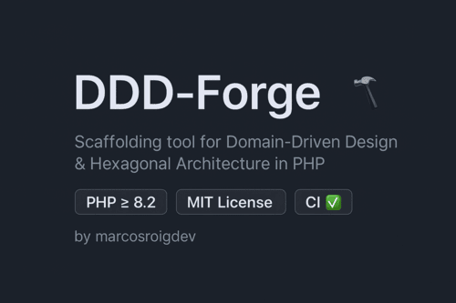

# DDD-Forge ⚒️

[](https://github.com/marcosroigdev/ddd-forge/actions/workflows/ci.yml)


[](https://packagist.org/packages/marcosroigdev/ddd-forge)
[](https://packagist.org/packages/marcosroigdev/ddd-forge)


**DDD-Forge** is a scaffolding tool for **Domain-Driven Design** and **Hexagonal Architecture** in PHP.  
Generate clean code, bounded contexts, aggregates, value objects, and use cases with a single command.

🚧 **Work in Progress** – expect rapid changes.

---

## ✨ Features

- ✅ Initialize hexagonal project structure (`init`)
- ⏳ Generate bounded contexts (`make:context`)
- ⏳ Create aggregates, value objects and domain events
- ⏳ Generate use cases and ports
- ⏳ Symfony & Laravel recipes
- ⏳ Test scaffolding

---

## 🚀 Installation

Require the package in your project (soon available via [Packagist](https://packagist.org)):

```bash
composer require --dev marcosroigdev/ddd-forge
```

Requires PHP >= 8.2.

## 📦 Usage

Run the CLI:

```bash
# Using composer script
composer run forge -- init

# Or directly
bin/ddd-forge init

```

This will generate the base folder structure:
```
src/
├── Domain
│   └── (Aggregates, ValueObjects, DomainEvents)
├── Application
│   └── (UseCases, Ports)
├── Infrastructure
│   └── (Repositories, Adapters)
└── UI
└── (CLI, HTTP, etc.)
```

## 🤝 Contributing

Contributions, ideas and feedback are welcome!
Please check CONTRIBUTING.md

## 📜 License

Released under the MIT License.